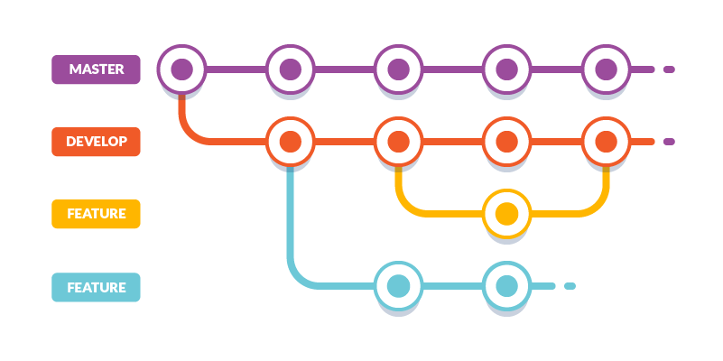

# CI-CD-RafaelTorices

Repository for the CI/CD subject of the module KeepCoding DevOps Bootcamp

## Description

This repository contains a simple application written in **Python** that uses the **Flask** framework. The application is a simple **_calculator web application_** with various operations (add, subtract, multiply, divide, power). The application is deployed in a **Kubernetes cluster** using **ArgoCD**. The application is automated using **CircleCI**. The application is tested using **pytest** and the coverage is calculated using **pytest-cov**. The application is linted using **pylint** and **flake8**. Also, the static code analysis is done using **SonarCloud**. All these tools have been used to create a CI/CD pipeline for the application.

## Repository structure

The repository is structured as follows:

- **.circleci**: Contains the configuration file for CircleCI

  - **config.yml**: Contains the configuration of the pipeline for CircleCI.

- [**argocd**](argocd/Readme.md): Contains the configuration files for ArgoCD ()

  - **argoapp.yml** file contains the configuration of the application in ArgoCD
  - **values.yaml** contains the values default for deploy Helm chart of ArgoCD.

- [**k8s**](k8s/Readme.md): Contains the Kubernetes manifests for the deployment of the application in the cluster

  - **deployment.yaml**: Contains the deployment of the application.
  - **ingress.yaml**: Contains the ingress of the application.
  - **service.yaml**: Contains the service of the application.

- [**src**](src/Readme.md): Contains the application python code.

  - **calculator.py**: Contains the code of the application.
  - **\_\_init\_\_.py**: Contains the code to initialize the application.
  - **templates/index.html**: Contains the html code template of the application.

- **tests**: Contains the tests for the python application code.

  - **\_\_init\_\_.py**: Contains the code to initialize the tests.
  - **test_calculator.py**: Contains the tests for the application code.

- **\_\_main\_\_.py**: Contains the code to initialize the application.

- **.gitignore**: Contains the files that are ignored by git.

- **Dockerfile**: Contains the instructions to create the docker image of the python application.

- **MANIFEST.in**: Contains the instructions to package the python application.

- **requirements.txt**: Contains the dependencies of the python application.

- **README.md**: Contains the description of the repository (this file).

- **setup.py**: Contains the instructions to package the python application.

> ## Note
>
> Each folder contains a README.md file with a description of its contents.

## Github individual repositories

- **Python application**: https://github.com/RafaTorices/pycalculator
- **CI/CD CircleCI**: https://github.com/RafaTorices/example_cicd_circleci
- **ArgoCD configuration**: https://github.com/RafaTorices/example_cicd_argocd
- **K8s manifests**: https://github.com/RafaTorices/example_k8s_deploy_app
- **DockerHub image**: https://hub.docker.com/repository/docker/rafacv99/pycalculator/general

## Aplication

### **Calculator.py**

    The application is a simple calculator that has the following operations with two numbers:

      - Add
      - Subtract
      - Multiply
      - Divide
      - Power

### **Version**

    python3.6 or higher

### **Dependencies**

    - Packaging: for packaging the application.
    - Pytest: for testing the application.
    - Coverage: for calculating the coverage of the application.
    - Pylint: for linting the application.
    - Flake8: for to check the code quality.
    - pdoc: for generating the documentation of the application.
    - Flask: for the web application.
    - Build: for building the package of the application.
    - setuptools: for building the package of the application.

### **Testing**

    The application is tested using pytest and the coverage is calculated using pytest-cov.

    The tests are run in the CircleCI pipeline.

The repository uses the Gitflow workflow. The repository branches:

- **main**: Contains the stable code of the application.
- **develop**: Contains the code in development of the application.
- **release**: Contains the code of the releases of the application.

## CI/CD pipeline

The CI/CD pipeline is created using CircleCI. The pipeline definition is in the **.circleci/config.yml** file.
For use the pipeline, you need to create a project in CircleCI (https://app.circleci.com/) and link it to the repository Github.

In resume, the pipeline has the following steps:

- **Executors**: docker
- **Jobs**:

  - **app-build**: Build the application.
  - **app-test**: Testing the application.
  - **app-docs**: Generate the documentation of the application.
  - **app-release**: Release the application.
  - **app-deploy**: Deploy the application.

- **workflows**: app-workflow

  - **app-build**: Build the application.
  - **app-test**: Requires build. Test the application.
  - **app-docs**: Requires build. Generate the documentation of the application.
  - **app-release**: Requires build, test and docs. Release the application.
  - **app-deploy**: Requires build. Deploy the application.

- **artifacts**: Generated by the jobs.

  - **app-test**: The test coverage xml and html of the application for testing.
  - **app-docs**: The documentation html of the application for review.
  - **app-release**: The package tar.gz of the application for distribution.
  - **app-deploy**: The package dockerhub of the application for upload to DockerHub.

- **orbs**: Used in the pipeline:
  - **SonarCloud**: For the static code analysis.
  - **GitGuardian**: For the secrets detection.

The pipeline is triggered when:

- Commit is made to the **develop** branch
- Commit is made to the **release** branch
- Commit is made to the **main** branch.

The pipeline generates the following artifacts:

- Docker image of the application in DockerHub: https://hub.docker.com/repository/docker/rafacv99/pycalculator/general

> #### Note (DockerHub)
>
> The pipeline contains a job for the upload of the docker image to DockerHub. For use the job, you need to create a repository in DockerHub (<https://hub.docker.com/>) and you need to create a token in DockerHub and add it to the CircleCI environment variables with the name DOCKERHUB_PASS and used in the pipeline for generate the artifact.

> #### Note (SonarCloud)
>
> The pipeline contains a job for the static code analysis using SonarCloud and use the SonarCloud Orb. For use the SonarCloud Orb, you need to create a project in SonarCloud (https://sonarcloud.io/) and link it to the repository Github. Also, you need to create a token in SonarCloud and add it to the CircleCI environment variables with the name SONAR_TOKEN. The context must be indicated in the workflow jobs. Also, you need to configure the file sonar-project-properties with parameters of the project in SonarCloud.

>  VIDEO SONARCLOUD

> #### Note (GitGuardian)
>
> The pipeline contains a job for the secrets detection using GitGuardian and use the GitGuardian Orb. But the job is commented because this project is private and the GitGuardian free plan only allows public projects. However, the job is configured and it has been checked that it works correctly as you can see in the following demo:

>  VIDEO GITGUARDIAN

## ArgoCD

The application is deployed in a Kubernetes cluster using ArgoCD. The configuration files are in the [**argocd**](argocd/Readme.md) folder.
The argoapp.yml file contains the configuration of the application in ArgoCD in the cluster k8s. The values.yaml file contains the values default for deploy Helm chart of ArgoCD.

## K8s

The application is deployed in a Kubernetes cluster using the manifests in the [**k8s**](k8s/Readme.md) folder.
The deployment.yaml file contains the deployment of the application. The ingress.yaml file contains the ingress of the application. The service.yaml file contains the service of the application.

## Sources

- keepcoding.io
- circleci.com
- argoproj.github.io
- kubernetes.io
- sonarcloud.io
- gitguardian.com
- python.org
- flask.palletsprojects.com
- pytest.org
- pdoc.dev
- docker.com
- hub.docker.com
- github.com
