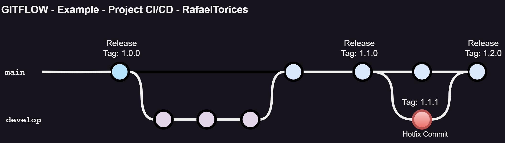

# CI-CD-RafaelTorices

Repository for the CI/CD subject of the module KeepCoding DevOps Bootcamp

## Description

This repository contains a simple application written in **Python** that uses the **Flask** framework. The application is a simple **_calculator web application_** with various operations (add, subtract, multiply, divide, power). The application is deployed in a **Kubernetes cluster** using **ArgoCD**. The application is automated using **CircleCI**. The application is tested using **pytest** and the coverage is calculated using **pytest-cov**. The application is linted using **pylint** and **flake8**. Also, the static code analysis is done using **SonarCloud**. All these tools have been used to create a CI/CD pipeline for the application.

## Repository structure

The repository is structured as follows:

- **.circleci**: Contains the configuration file for CircleCI

  - **config.yml**: Contains the configuration of the pipeline for CircleCI.

- [**argocd**](argocd/Readme.md): Contains the configuration files for ArgoCD ()

  - **argoapp.yml** file contains the configuration of the application in ArgoCD
  - **values.yaml** contains the values default for deploy Helm chart of ArgoCD.

- [**k8s**](k8s/Readme.md): Contains the Kubernetes manifests for the deployment of the application in the cluster

  - **deployment.yaml**: Contains the deployment of the application.
  - **ingress.yaml**: Contains the ingress of the application.
  - **service.yaml**: Contains the service of the application.

- [**src**](src/Readme.md): Contains the application python code.

  - **calculator.py**: Contains the code of the application.
  - **\_\_init\_\_.py**: Contains the code to initialize the application.
  - **templates/index.html**: Contains the html code template of the application.

- **tests**: Contains the tests for the python application code.

  - **\_\_init\_\_.py**: Contains the code to initialize the tests.
  - **test_calculator.py**: Contains the tests for the application code.

- **\_\_main\_\_.py**: Contains the code to initialize the application.

- **.gitignore**: Contains the files that are ignored by git.

- **Dockerfile**: Contains the instructions to create the docker image of the python application.

- **MANIFEST.in**: Contains the instructions to package the python application.

- **requirements.txt**: Contains the dependencies of the python application.

- **README.md**: Contains the description of the repository (this file).

- **setup.py**: Contains the instructions to package the python application.

> ## Note
>
> Each folder contains a README.md file with a description of its contents.

## Github individual repositories

- **Python application**: https://github.com/RafaTorices/pycalculator
- **ArgoCD configuration**: https://github.com/RafaTorices/example_cicd_argocd
- **K8s manifests**: https://github.com/RafaTorices/example_k8s_deploy_app
- **Docker image**: https://hub.docker.com/repository/docker/rafacv99/pycalculator/general

## Aplication

**src/calculator.py**:
Contains the code of the application.

    The application is a simple calculator that has the following operations: - Add - Subtract - Multiply - Divide - Power

**Dependencies**

    - Packaging: for packaging the application.
    - Pytest: for testing the application.
    - Coverage: for calculating the coverage of the application.
    - Pylint: for linting the application.
    - Flake8: for to check the code quality.
    - pdoc: for generating the documentation of the application.
    - Flask: for the web application.
    - Build: for building the package of the application.
    - setuptools: for building the package of the application.

## Gitflow

The repository uses the Gitflow workflow. The repository branches:

- **main**: Contains the stable code of the application.
- **develop**: Contains the code in development of the application.
- **release**: Contains the code of the releases of the application.

## CI/CD pipeline

The CI/CD pipeline is created using CircleCI. The pipeline definition is in the **.circleci/config.yml** file. In resume, the pipeline has the following steps:

- **Executors**: docker
- **Jobs**:

  - **app-build**: Build the application.
  - **app-test**: Testing the application.
  - **app-docs**: Generate the documentation of the application.
  - **app-release**: Release the application.
  - **app-deploy**: Deploy the application.

- **workflows**: app-workflow

  - **app-build**: Build the application.
  - **app-test**: Requires build. Test the application.
  - **app-docs**: Requires build. Generate the documentation of the application.
  - **app-release**: Requires build, test and docs. Release the application.
  - **app-deploy**: Requires build. Deploy the application.

- **artifacts**: Generated by the jobs.

  - **app-test**: The test coverage xml and html of the application.
  - **app-docs**: The documentation html of the application.
  - **app-release**: The package tar.gz of the application.
  - **app-deploy**: The package dockerhub of the application.
