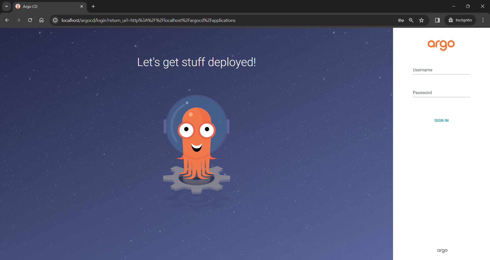
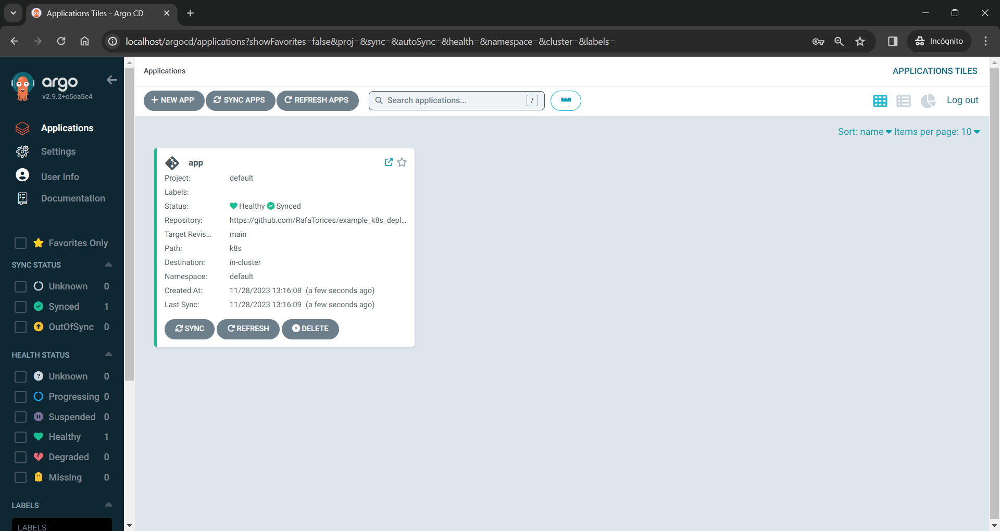
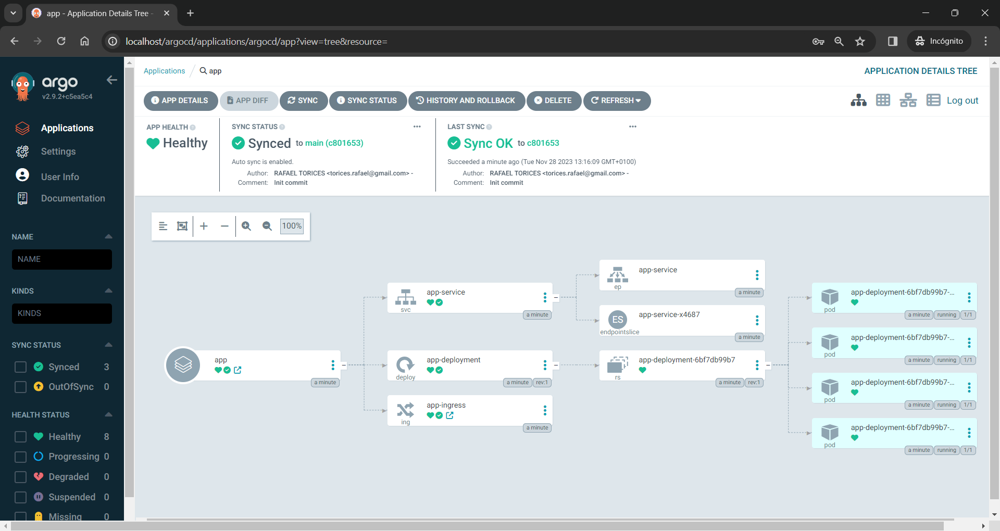
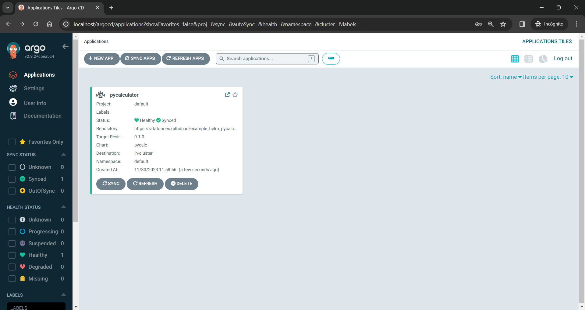
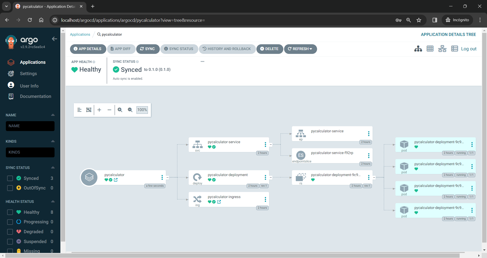

## Example Manifiest File for a ArgoCD project

### Author: RafaelTorices

This is a example of a ArgoCD project manifiest file. This file is used to create a ArgoCD project and link it to a Git repository, in this case, the repository is a deployment of a simple python flask app web application in a Kubernetes cluster. Also, `argopycalculator.yaml` file contains the configuration of the application in ArgoCD using the Helm chart of the application for deploy the application in the Kubernetes cluster controlled by ArgoCD.



## Pre-requisites

- Kubernetes cluster installed and running
- Kubectl installed and configured
- Deploy ingress controller: https://kubernetes.github.io/ingress-nginx/deploy/ in the namespace ingress-nginx of the cluster
- ArgoCD installed and running: https://argo-cd.readthedocs.io/en/stable/
- Helm installed and running: https://helm.sh/docs/intro/install/

## How to use

1.  Clone this repository
2.  Install chart of ArgoCD project:
    ```
        helm repo add argo https://argoproj.github.io/argo-helm
    ```
3.  Install ArgoCD project:
    ```
        helm upgrade --install --wait --timeout 15m --atomic --namespace argocd --create-namespace \
        --repo https://argoproj.github.io/argo-helm argocd argo-cd --values values.yaml
    ```

> This command will install a ArgoCD project in the namespace argocd and will use the values.yaml file to configure the project.

> For obtain the password of the ArgoCD UI, execute the following command:
>
> `kubectl -n argocd get secret argocd-initial-admin-secret -o jsonpath="{.data.password}" | base64 -d`

4.  Check the ArgoCD project is running:

    ```
        kubectl get pods -n argocd
    ```

5.  Access to the ArgoCD UI:

    ```
        http://localhost/argocd
    ```

6.  Login with the user **admin** and the password obtained in the step 3.

7.  Apply the manifiest file `argoapp.yaml` to create the ArgoCD application obtained from the Github repository:

    ```
        kubectl apply -f argoapp.yaml
    ```

8.  Apply the manifiest file `argopycalculator.yaml` to create the ArgoCD application obtained from the Helm chart of the application of the Github Pages repository:

    ```
        kubectl apply -f argopycalculator.yaml
    ```

9.  Check the application is running in the Kubernetes cluster:
    ```
        kubectl get pods
    ```
## Screenshots of the ArgoCD UI with the applications deployed since the Github repository






## Screenshots of the ArgoCD UI with the applications deployed since the Helm chart of the application of the Github Pages repository




